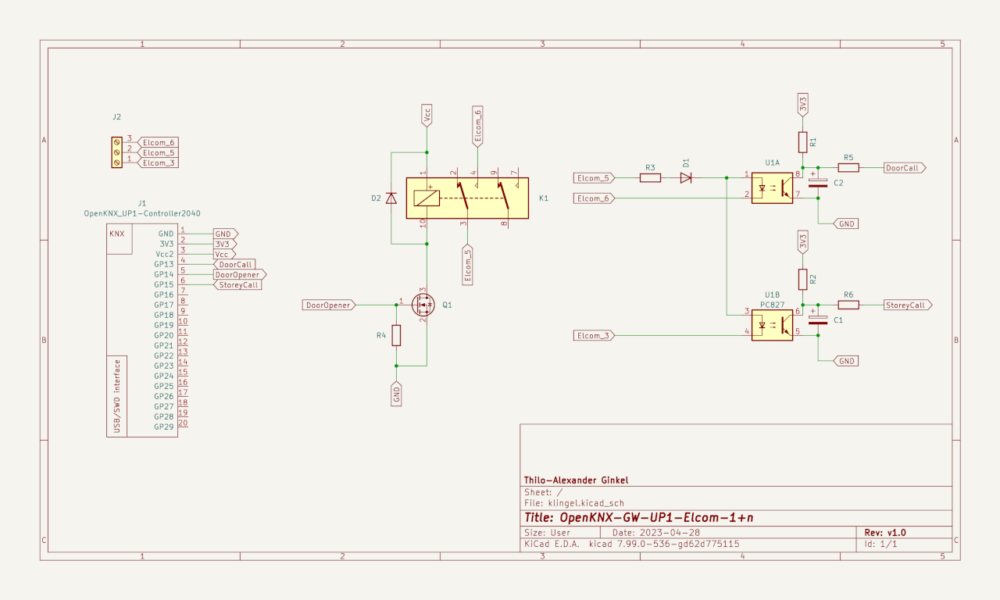

# OpenKNX: Elcom-1+n-Gateway

This repository hosts the OpenKNX-based firmware for an Elcom-1+n KNX Gateway that can interface a legacy Elcom-1+n doorbell system with KNX. It supports both the main doorbell and the storey call ("Etagenruf") as well as actuating the door opener.

Its hardware is based on the [OpenKNX UP1 System](https://github.com/OpenKNX/OpenKNX/wiki/OpenKNX-UP1) used in combination with a custom application PCB.

## Schematics

## BOM

* R1, R2: 0805 10 kΩ SMD resistors
* R3: 0805 100 Ω SMD resistor
* R4: 0805 100 kΩ SMD resistor
* R5, R6: 0805 1 kΩ SMD resistors
* D1, D2: SOD-123 1N4148 SMD diodes
* C1, C2: 0805 10 uF 10 V SMD MLCC
* Q1: SOT-23 BSS138 SMD MOSFET
* K1: Zettler AZ850-5 relay
* U1: LiteOn LTV-827 optocoupler
* J2: 2.54 mm 3-pin screw terminal

## Legalese

All product names and any registered and unregistered trademarks mentioned are used for identification purposes only and remain the exclusive property of their respective owners.

This project is not endorsed by or affiliated with Hager.
